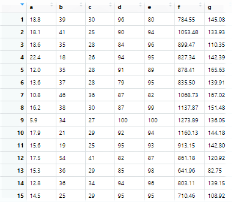
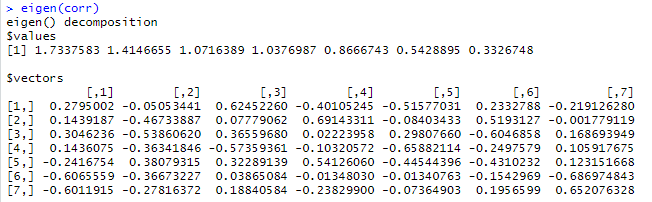
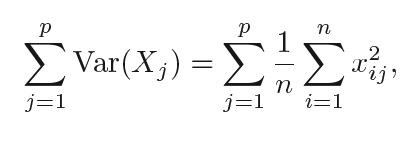
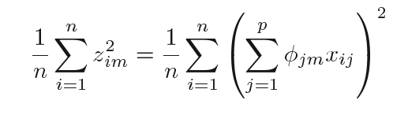
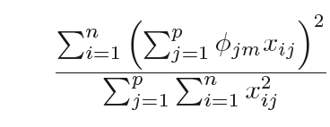
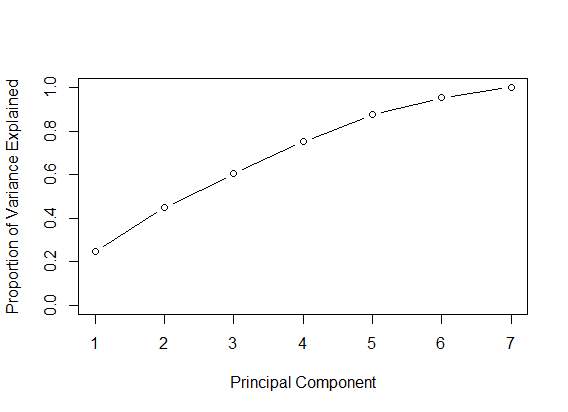
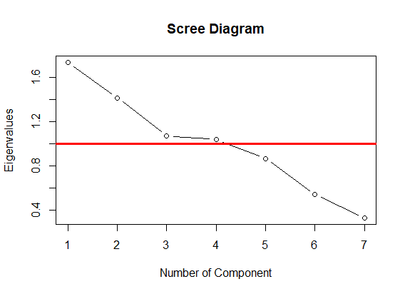
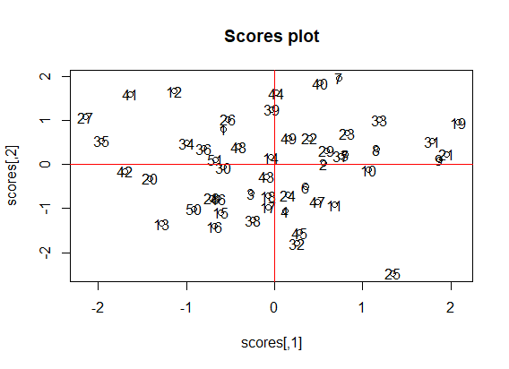

---
output:
  word_document: default
  pdf_document: default
  html_document: default
---
# Principal Components Analysis
## Abstract
This contribution develops an analysis on the dataset 'bad-drivers.csv' (taken from github.com/fivethirtyeight/data) by running the Principal Components Analysis. In particular, the keypoints of the study are the different steps in the computation of the principal componets with associated analysis:  
1. Computation of eigenvalues and eigenvectors
2. Definition of the correlation matrix
3. Different methods to choose the principal components 
4. Analysis of the communality
5. Computation of scores and loadings.

#Description of the dataset
I chose the dataset 'bad-drivers.csv' (taken from github.com/fivethirtyeight/data), that considers data whose sources are: National Highway Traffic Safety Administration and National Association of Insurance Commissioners. This folder contains data behind the story 'Dear Mona, Which State Has The Worst Drivers?', where Mona Chalabi, a British data journalist answer some questions about drivers and car accidents in the USA. She says that historic data that could indicate where America's worst drivers are: the number of car crashes in each state (especially those where the driver was negligent in some way), how much insurance companies pay out, and how much insurance companies charge drivers. The reported variables are: 
.	State (a specific country in the USA); 
.	Number of drivers involved in fatal collisions per billion miles; 
.	Percentage of drivers involved in fatal collisions who were speeding;
.	Percentage of drivers involved in fatal collisions who were alcohol impaired;
.	Percentage of drivers involved in fatal collisions who were not distracted;
.	Percentage of drivers involved in fatal collisions who had not been involved in any previous accidents;
.	Car insurance premiums;
.	Losses incurred by insurance companies for collisions per insured driver.
I chose to compute the predictions on the variable 'Losses incurred by insurance companies for collisions per insured driver' (variable y).

## Analysis
The Principal Component Analysis is one of the unsupervised learning methods and, as all unsupervised methods, it is much more challenging than supervised learning: in fact, it is often performed as an exploratory data analysis, whose goal is to check if there exist a possible dimension of the dataset in which I can study my data and see the relation between the variables.
My goal here is to find a low-dimension representation of the dataset by defining the principal components.
First of all, I imported the dataset, renamed all the columns and chose not to consider the first column of the dataset in order to make it easier to do the whole analysis. 
These are the first fifteen rows as example:



Then my analysis starts with the definition of the number of rows and columns, since they are useful for the next steps. In this case the number of rows (n) is 51 and the number of column (p) is 7.
Two other elements needed are the mean and the standard deviation for each variable reported in the dataset. I built a table to summarize the means and the standard deviations; the output is the following:
| |   mean | std  |
|-|--------|------|   
|a|  15.79 |  4.12|
|b|  31.73 |  9.63|
|c|  30.69 |  5.13|
|d|  85.92 | 15.16|
|e|  88.73 |  6.96|
|f| 886.96 |178.30|
|g| 134.49 | 24.84|

Based on this, I decided to run the analysis by starting from the correlation matrix (the alternative is the covariance matrix) that is the following:

| |      a|      b|      c|      d|      e|      f|      g|
|-|-------|-------|-------|-------|-------|-------|-------|
|a|  1.000| -0.029|  0.199|  0.010| -0.018| -0.200| -0.036|
|b| -0.029|  1.000|  0.286|  0.132|  0.014|  0.043| -0.061|
|c|  0.199|  0.286|  1.000|  0.043| -0.245| -0.017| -0.084|
|d|  0.010|  0.132|  0.043|  1.000| -0.195|  0.020| -0.058|
|e| -0.018|  0.014| -0.245| -0.195|  1.000|  0.076|  0.043|
|f| -0.200|  0.043| -0.017|  0.020|  0.076|  1.000|  0.623|
|g| -0.036| -0.061| -0.084| -0.058|  0.043|  0.623|  1.000|

The absolute values are between 0 and 1 and it is possible to get the following information:
-if the correlation is equal to 1 then the relationship is linear
-in case the value is close to 0, it is non-linear
-if both values tend to increase or decrease together the coefficient is positive, and the line that represents the correlation slopes upward, otherwise the coefficient is negative.
In this case, most of the values have non-linear relationship. 

## Choice of principal components
Then, there is a very important step: the choice of the principal components.
It canbe done in different ways, the first is the definition of the eigenvalues and eigenvectors.
The  eigenvalues and eigenvectors of a correlation (or covariance) matrix represent the "core" of a PCA: the eigenvectors (principal components) represent the directions of the new feature space, whereas the eigenvalues determine their magnitude and, consequently explain the variance of the data along the new feature axes. 
The R function 'eigen()' outputs the eigenvalues and eigenvectors:



The eigenvector with the highest eigenvalues is then considered as principal components in most cases.In this case, the first four components are able to axplain at least one variable by themselves.
However it is possible to base the choice of the principal components on the proportion of variance explained, which indicates how much of the variance in the data is not contained in the first few principal components. In other words, the proportion of variance explained helps in understanding the strenght of each component. The total variance present in a dataset is defined as:



and the variance explained by m-th principal component by:

.

Then, the PVE of the m-th component is given by:

.

Therefore I computed the PVE, by considering that it is equal to the ratio between the eigenvalues and the number of columns, and the cumulative variance explained.The following table shows the eigenvalues, the pve and the cumulative pve:

|    | eigenvelues| % variance| % cum variance|
|----|------------|-----------|---------------|
|[1,]|        1.73|      24.77|          24.77|
|[2,]|        1.41|      20.21|          44.98|
|[3,]|        1.07|      15.31|          60.29|
|[4,]|        1.04|      14.82|          75.11|
|[5,]|        0.87|      12.38|          87.49|
|[6,]|        0.54|       7.76|          95.25|
|[7,]|        0.33|       4.75|         100.00|

The cumulative proportion of explained variance is represented by the following graph:



At this stage, it is possible to visually define the principal components by using the Scree Plot.
In fact, I chose the components located above the red line in the following diagram, where the components are on x and the eigenvalues on y, that indicates values greater than 1:



Based on this, I chose the first four components, confirming the counclusions done on the output of the 'eigen()' function.
I built the matrix of the four components, obtained by multiplying the eigenvector by the root of the respective eigenvalue.

| |    Comp1|    Comp2|    Comp3|    Comp4|
|-|---------|---------|---------|---------|
|a| -0.36802|  0.06011| -0.64651|  0.40854|
|b| -0.18950|  0.55585| -0.08053| -0.70435|
|c| -0.40110|  0.64062| -0.37847| -0.02265|
|d| -0.18909|  0.43225|  0.59378|  0.10513|
|e|  0.31822| -0.45291| -0.33426| -0.55137|
|f|  0.79867|  0.43619| -0.04001|  0.01373|
|g|  0.79160|  0.33085| -0.19504|  0.24275|

This table shows the correlations of the original variables with each of the four components. For example the variables 'f' and 'g' have a high correlation with the first component (79%), 'b' and 'c' have a relatively high correlation with the second one (respectively 55% and 64%).
Another element that can be considered is the communality that tells how is the part of variance explained for each variable after the reduction and, consequently which is the loss that I have for each single variable. Mathematically, the communality is the sum of the squared component loadings based on how many components are chosen.
Using four components, I get the following results:

| |    Comp1|    Comp2|    Comp3|    Comp4| communality|
|-|---------|---------|---------|---------|------------|
|a| -0.36802|  0.06011| -0.64651|  0.40854|   0.7239320|
|b| -0.18950|  0.55585| -0.08053| -0.70435|   0.8474735|
|c| -0.40110|  0.64062| -0.37847| -0.02265|   0.7150278|
|d| -0.18909|  0.43225|  0.59378|  0.10513|   0.5862221|
|e|  0.31822| -0.45291| -0.33426| -0.55137|   0.7221301|
|f|  0.79867|  0.43619| -0.04001|  0.01373|   0.8299248|
|g|  0.79160|  0.33085| -0.19504|  0.24275|   0.8330604|

In other words, I get:
-72% of the variance of 'a'(Number of drivers involved in fatal collisions per billion miles) explained,
-84% of the variance of 'b' (Percentage of drivers involved in fatal collisions who were speeding) explained,
-71% of the variance of 'c' (Percentage of drivers involved in fatal collisions who were alcohol impaired) explained,
-58% of the variance of 'd' (Percentage of drivers involved in fatal collisions who were not distracted) explained,
-72% of the variance of 'e' (Percentage of drivers involved in fatal collisions who had not been involved in any previous accidents) explained,
-82% of the variance of 'f' (Car insurance premiums) explained,
-83% of the variance of 'g' (	Losses incurred by insurance companies for collisions per insured driver) explained.

## Scores and Loadings
What can be done next is the computation of the scores for the selected components and the loadings. 
To compute the scores, I started from the multiplication of the scale variables of the dataset 'bad_drivers' by the eigenvectors.
It is possible to check which are the most influential variables and the relationships.
The graph below, which reports the 51 States of the dataset, shows that the relationships are very weak:



Another important graph is the Loading Plot:

[](images/Rplot03.png)

The distance from the origin conveys information. The further away from the plot origin a variable lies, the stronger the impact that variable has on the model. 

## Conclusions
In conclusion, the PCA is an exploratory approach, very useful when you want to build a low-dimensional representation of the dataset. As seen in the study, thanks to the definition of the eigenvelues and eigenvector and thanks to the computation of the proportion of variance explained, it is possible to define the principal componets. The proportion of variance explained helps in interpreting the data and the role of the principal components, in fact the goal is to understand how much of the original data is represented by the chosen components. Based on this, the following analysis give many descriptive information.Then the cumulative proprtion of variance explained, tells how much of variance for each component added to the variances of the previous ones is explained by the original variables. In this case the first four variables, whose eigenvalues are greater than 1, have a cumulative percentage of variance of 75%. The other important element is the communality that, as seen above, gives and idea of how much the original variables are explained by each new component. The results can be interpreted as good since the percentages are all above 70%, except for the variable 'd' (Percentage of drivers involved in fatal collisions who were not distracted) which has a percentage of 58% that is still acceptable.

```
#principal component analysis 
bad_drivers <- read.csv("https://raw.githubusercontent.com/fivethirtyeight/data/master/bad-drivers/bad-drivers.csv", sep = ",")
head(bad_drivers)
dir.create("data")
save(bad_drivers, file=file.path("data","bad_drivers.rda"))
a <- bad_drivers$Number.of.drivers.involved.in.fatal.collisions.per.billion.miles
b <- bad_drivers$Percentage.Of.Drivers.Involved.In.Fatal.Collisions.Who.Were.Speeding
c <- bad_drivers$Percentage.Of.Drivers.Involved.In.Fatal.Collisions.Who.Were.Alcohol.Impaired
d <- bad_drivers$Percentage.Of.Drivers.Involved.In.Fatal.Collisions.Who.Were.Not.Distracted
e <- bad_drivers$Percentage.Of.Drivers.Involved.In.Fatal.Collisions.Who.Had.Not.Been.Involved.In.Any.Previous.Accidents
f <- bad_drivers$Car.Insurance.Premiums....
g <- bad_drivers$Losses.incurred.by.insurance.companies.for.collisions.per.insured.driver....

bad_drivers <- data.frame(a,b,c,d,e,f,g)
bad_drivers

n <- nrow(bad_drivers) #number of rows
p <- ncol(bad_drivers) #number of columns

# mean and std:
mean <- colMeans(bad_drivers)
std <- apply(bad_drivers, 2, sd)
table <- round(cbind(mean, std),2)
table

## PCA starting from correlation matrix
corr <- cor(bad_drivers)
round(corr,3)


# computation of eigenvalues and eigenvectors:
eigen(corr)
eigenvalues <- eigen(corr)$values
eigenvectors <- eigen(corr)$vectors
eigenvalues
eigenvectors

#proportion of variance explained
pve = eigenvalues/p
pvecum = cumsum(pve)
tab <- round(cbind(eigenvalues,pve*100,pvecum*100),2)
colnames(tab)<-c("eigenvelues", "% variance","% cum variance")
tab
plot(pvecum, xlab="Principal Component", ylab="Proportion of Variance Explained", ylim=c(0,1),type='b')

#Scree Diagram to select the components:
plot(eigenvalues, type="b", main="Scree Diagram", xlab="Number of Component", ylab="Eigenvalues")
abline(h=1, lwd=3, col="red")

#Select 4 components 
eigen(corr)$vectors[,1:4]


#Matrix of the components
comp <- round(cbind(-eigen(corr)$vectors[,1]*sqrt(eigenvalues[1]),-eigen(corr)$vectors[,2]*sqrt(eigenvalues[2]),-eigen(corr)$vectors[,3]*sqrt(eigenvalues[3]),-eigen(corr)$vectors[,4]*sqrt(eigenvalues[4])),5)
rownames(comp)<-row.names(table)
colnames(comp)<-c("Comp1","Comp2","Comp3","Comp4")
comp

#communality
communality<-comp[,1]^2+comp[,2]^2+comp[,3]^2+comp[,4]^2
comp<-cbind(comp,communality)
comp


#scores
bad_drivers.scale <- scale(bad_drivers, T, T)
score <- bad_drivers.scale%*%eigenvectors[,1:4]

# score diagram
scores<-round(cbind(-score[,1]/sqrt(eigenvalues[1]),-score[,2]/sqrt(eigenvalues[2]),-score[,3]/sqrt(eigenvalues[3]),-score[,4]/sqrt(eigenvalues[4])),4)
plot(scores, main="Scores plot")
text(scores, rownames(bad_drivers))
abline(v=0,h=0,col="red")
# Loadings plot
plot(comp[,1:4], main="Loadings plot", xlim=range(-1,1))
text(comp, rownames(comp))
abline(v=0,h=0,col="red")
```
